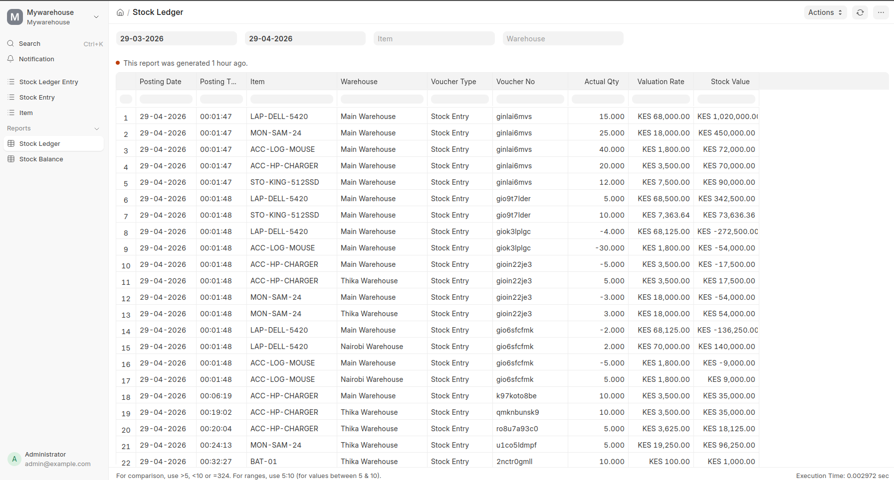

# Warehouse Management System
A warehouse management system built with **Frappe Framework**. Handles stock movement, inventory valuation, warehouse organization, and comprehensive reporting using a ledger-based inventory model.

## Overview

This system provides complete inventory control for multi-warehouse operations with real-time stock tracking, moving average valuation, and detailed audit trails.

---

## Features

### Core Functionality
- **Multi-warehouse support** — Organize inventory across multiple physical locations
- **Stock operations** — Receipt, Consume, Transfer, and Opening Stock transactions
- **Ledger-based tracking** — Complete audit trail of all inventory movements
- **Moving average valuation** — Accurate cost tracking for inventory
- **Negative stock prevention** — Built-in validation to prevent overselling
- **Real-time balances** — Instant visibility into warehouse stock levels

### DocTypes
- **Item** — Product catalog with identifiers and metadata
- **Warehouse** — Physical or logical storage locations
- **Stock Entry** — Transaction document recording inventory movement
- **Stock Entry Item** — Line items within a Stock Entry
- **Stock Ledger Entry** — Elementary record of each stock movement

### Reports
- **Stock Ledger Report** — Complete transaction history line by line



- **Stock Balance Report** — Current stock levels summarized by item and warehouse

### Data Integrity
- Comprehensive validation rules
- Warehouse-specific transaction controls
- Transfer validation (source/target matching)
- Server-side business logic in Python
- Full test coverage

---

## Technical Architecture

### Project Structure
```
mywarehouse/
├── mywarehouse/
│   ├── doctype/              # DocType definitions
│   │   ├── item/
│   │   ├── warehouse/
│   │   ├── stock_entry/
│   │   ├── stock_entry_item/
│   │   └── stock_ledger_entry/
│   ├── report/               # Reports
│   │   ├── stock_ledger/
│   │   └── stock_balance/
│   ├── config/
│   ├── patches/              # Database migrations
│   ├── public/               # CSS/JS assets
│   └── templates/            # UI templates
├── pyproject.toml
├── hooks.py
└── README.md
```

### Inventory Model

#### Stock Entry Types

| Type | Source | Target | Result |
|------|--------|--------|--------|
| **Receipt** | — | Warehouse | ➕ Positive ledger entry |
| **Consume** | Warehouse | — | ➖ Negative ledger entry |
| **Transfer** | Warehouse | Warehouse | ➖ & ➕ Paired ledger entries |
| **Opening Stock** | — | Warehouse | ➕ Positive ledger entry |

#### Stock Ledger Entry

The foundational record for all inventory tracking:
- **Item** & **Warehouse** — Identifies the stock location
- **Quantity & Valuation Rate** — Qty moved and cost per unit
- **Stock Value** — Total cost of transaction
- **Posting Date/Time** — When the movement occurred
- **Voucher Reference** — Links to Stock Entry

#### Valuation Method

**Moving Average Costing:**
- **Inbound:** New average = (Current Stock Value + Incoming Stock Value) ÷ (Current Qty + Incoming Qty)
- **Outbound:** Uses current average cost rate

---

## Installation

### Prerequisites
- Frappe Framework v16 (or compatible version)
- Python 3.8+
- Existing Frappe bench setup

### Setup Steps

1. **Navigate to your bench directory:**
   ```bash
   cd frappe-v16-bench
   ```

2. **Install the app:**
   ```bash
   bench --site warehouse install-app mywarehouse
   ```

3. **Run migrations:**
   ```bash
   bench --site warehouse migrate
   ```

4. **Start the development server:**
   ```bash
   bench start
   ```

5. **Access the application:**
   ```
   Open http://localhost:8000 in your browser
   ```

---

## Usage

### Creating Stock Movements

1. Navigate to **Stock Entry** list
2. Click **+ New Stock Entry**
3. Select transaction **Type** (Receipt, Consume, Transfer, Opening Stock)
4. Fill in **Item**, **Quantity**, and **Warehouse** details
5. Click **Save** and then **Submit**
6. Stock Ledger entries are created automatically

### Viewing Reports

- **Stock Ledger Report:** Complete record of all transactions
- **Stock Balance Report:** Current inventory by item and warehouse

---

## Testing

Run the full test suite:
```bash
bench --site warehouse run-tests --app mywarehouse --verbose
```

Run tests for a specific module:
```bash
bench --site warehouse run-tests --app mywarehouse --module mywarehouse.mywarehouse.doctype.stock_entry.test_stock_entry --verbose
```

**Test Coverage:**
- Item and Warehouse creation
- Stock operations (Receipt, Consume, Transfer, Opening)
- Negative stock validation
- Moving average valuation accuracy
- Report data accuracy

---

## Example Data

### Sample Warehouses
- Main Warehouse (Primary distribution center)
- Thika Warehouse (Regional hub)
- Nairobi Warehouse (Customer fulfillment)

### Sample Items
- Dell Latitude 5420 Laptop
- Samsung 24" Monitor
- Logitech Wireless Mouse
- HP Laptop Charger
- Kingston 512GB SSD

---

## Development

### Key Files
- `mywarehouse/doctype/*/` — DocType Python and JSON definitions
- `mywarehouse/report/*/` — Report logic and configurations
- `hooks.py` — App hooks and fixture definitions

### Adding New Features
1. Create DocType in `mywarehouse/doctype/`
2. Add corresponding test file (`test_*.py`)
3. Run tests to verify functionality
4. Update documentation

---

## Notes

**Built for:** X Electronics Warehouse Management Exercise  
**Framework:** Frappe Framework  
**Language:** Python 3  
**Database:** MariaDB (via Frappe)

**Design Focus:**
- Clean separation of concerns
- ERP-style stock movement handling
- Precise inventory reporting
- Comprehensive test coverage
- Production-ready validation

---

## Author

**Ruth Kamau** 
